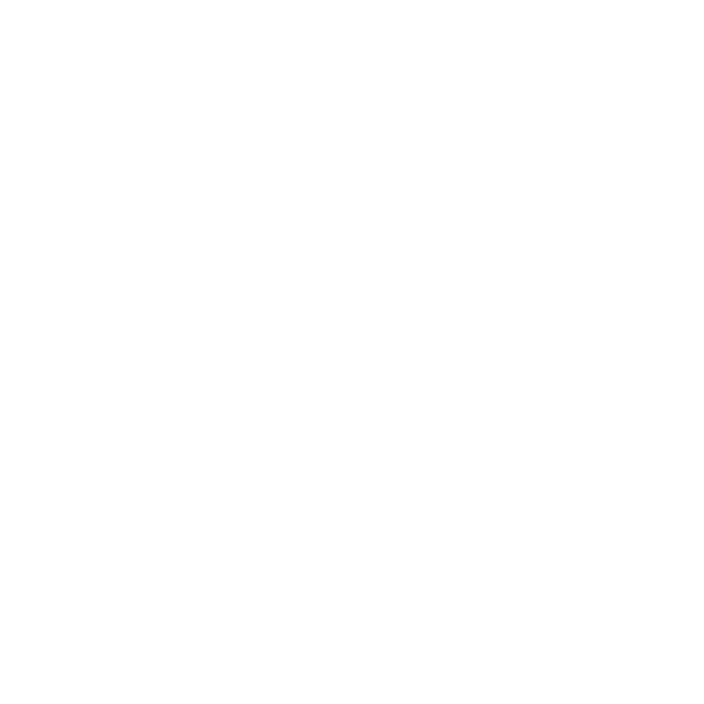
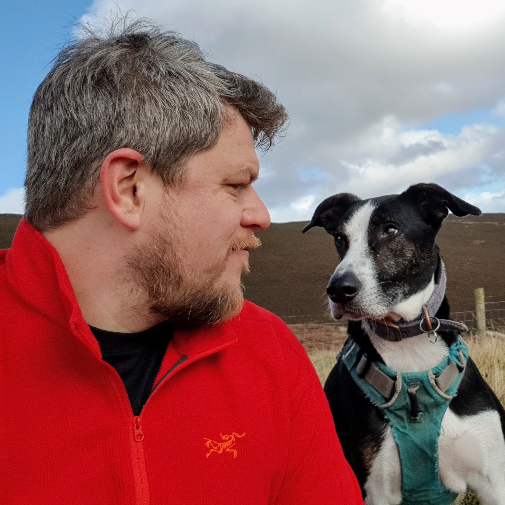

<!-- effect=stars -->


## Lessons Learnt from Teaching an ADAS Company to DevOps



### Andy Cowley - Five

---
<!-- fg=white bg=black -->

## Who's this guy?

**Andy Cowley** - Engineering Manager @Five



 @andycowley_

---
<!-- fg=white bg=black -->


# How it Started

---

## Once upon a time


---
<!-- fg=white bg=black -->

## What did we actually do?

- Conversations with customers
- Active engagement
    - Guild
    - Buddies
    - Training
- Self-service
    - Kubernetes as a compute platform
    - ElasticSearch, Prometheus, Sentry
    - Shared TF libraries - Docs, docs, and more docs

---
<!-- fg=white bg=black -->

## Platforms and Platform Teams

### Evan Bottcher

> “A digital platform is a foundation of self-service APIs, tools, services, knowledge and support which
> are arranged as a compelling internal product. Autonomous delivery teams can make use of the
> platform to deliver product features at a higher pace, with reduced coordination.”

```

```

### Matthew Skelton and Manuel Pais -- Team Topologies

> The purpose of a platform team is to enable stream-aligned teams to deliver work with substantial
> autonomy. The stream-aligend team maintains full ownership of building, running, and fixing their
> application in production. The platform team provides internal services to reduce the cognitive load
> that would be required from stream-aligend teams to develop these underlying services.


---
<!-- fg=white bg=black -->

## Pulled in all directions


```
                   ^
                   |
                   |
                   |
                   |
                   |
                   |
                   v

                   0
<------------->   /|\   <------------->
                   ^
                  / \
                   ^
                   |
                   |
                   |
                   |
                   |
                   v
```

---

## Enablers

> The Engineering Enablement Team is responsible for the advocacy, and adoption of the
> Infrastructure Platform and its features, the dissemination of good practice, knowledge and
> tooling, the bridging of skills gaps, and taking the pressure off the Infrastructure Platform team
> with respect to deep collaboration with product teams. It aims to form a tight feedback loop with
> the Infrastructure Platform team, to drive positive change and continuous improvement.

---
<!-- fg=white bg=black -->

## Team Topology

```
+-----------------+
| Engineering     |
|                 |
| Enablement   +--+-------------------------------------------+
|              |  |                                           |
| Team         |  |          Component Team A                 |
|        ------+> |                                           |
|              +--+--------------------------+----------------+
|                 |                          |
|              +--+--------------------------+----------------+
|              |  |                          |                |
|              |  |         Component Team B |                |
|              |  |                          |                |
|              +--+---------------------+----+----------------+
|                 |                     |    |
|collaboration +--+---------------------+----+----------------+
|        ------+> |                     |    |                |
|              |  |     Component Team C|    |                |
|              |  |                     |    |                |
|              +--+----------------+----+----+----------------+
|                 |                |    |    |
+-----------------+                |    |    | X-as-a-Service
                                   |    |    |
         +-------------------------v----v----v----------------+
         |                                                    |
         |                                                    |
         |         Infrastructure Platform Team               |
         |                                                    |
         |                                                    |
         +----------------------------------------------------+

```

---
<!-- effect=fireworks -->

### Utopia

-  Infra guild to spread interest, and talk about new and exciting things
-  Enablement team to collaborate, advocate, and close the skills gaps
-  Amazing and comprehensive documentation for excellent reference and bootstrapping
-  Self service all the things
-  Dedicated support channel

---

### End of Act One


---
<!-- effect=matrix -->


# How it's Going

---

## Premature Optimisation
<!-- fg=white bg=black -->

```
⣿⣿⣿⣿⣿⣿⣿⣿⣿⠿⠛⠛⠿⢿⣿⣿⣿⣿⣿⣿⣿⣿⣿⣿⣿⣿⣿⣿⣿⣿⣿⣿⣿⣿⣿⣿⣿⣿⣿⣿⣿⣿⣿⣿⣿⣿⣿⣿⣿⣿
⣿⣿⣿⣿⣿⣿⣿⣿⡏⠀⠀⠀⠀⠀⠹⣿⣿⣿⣿⣿⣿⣿⣿⣿⣿⣿⣿⣿⣿⣿⣿⣿⣿⣿⣿⣿⣿⣿⣿⣿⣿⣿⣿⣿⣿⣿⣿⣿⣿⣿
⣿⣿⣿⣿⣿⣿⣿⣿⡇⠀⠀⠀⠀⠀⠀⢻⣿⣿⣿⣿⣿⣿⣿⣿⣿⣿⣿⣿⣿⣿⣿⣿⣿⣿⣿⣿⣿⣿⣿⣿⣿⣿⣿⣿⣿⣿⣿⣿⣿⣿
⣿⣿⣿⣿⣿⣿⣿⣿⣿⠀⠀⠀⠀⠀⠀⠸⣿⣿⣿⣿⣿⣿⣿⣿⣿⣿⣿⣿⣿⣿⣿⣿⣿⣿⣿⣿⣿⣿⣿⣿⣿⣿⣿⣿⣿⣿⣿⣿⣿⣿
⣿⣿⣿⣿⣿⣿⣿⣿⣿⡄⠀⠀⠀⠀⠀⠀⣿⣿⣿⣿⣿⣿⣿⣿⣿⣿⣿⣿⣿⣿⣿⣿⣿⣿⣿⣿⣿⣿⣿⣿⣿⣿⣿⣿⣿⣿⣿⣿⣿⣿
⣿⣿⣿⣿⣿⣿⣿⣿⣿⠇⠀⠀⠀⠀⠀⠀⣿⣿⣿⣿⣿⣿⣿⣿⣿⣿⣿⣿⣿⣿⣿⣿⣿⣿⣿⣿⣿⣿⣿⣿⣿⣿⣿⣿⣿⣿⣿⣿⣿⣿
⣿⣿⣿⣿⣿⣿⣿⣿⡿⠀⠀⠀⠀⠀⠀⠀⠹⣿⣿⣿⣿⣿⣿⣿⣿⣿⣿⣿⣿⣿⣿⣿⣿⣿⣿⡿⠿⠿⠛⠛⠋⠉⠀⠀⠀⠈⠹⣿⣿⣿
⣿⣿⣿⣿⣿⣿⣿⣿⠃⠀⠀⠀⠀⠀⠀⠀⠀⠈⠙⠛⠛⠛⠛⠛⠛⠉⠉⠉⠉⠉⠉⠁⠀⠀⠀⠀⠀⠀⠀⠀⠀⠀⠀⠀⠀⠀⢀⣿⣿⣿
⣿⣿⣿⣿⣿⣿⣿⡏⠀⠀⠀⠀⠀⠀⠀⠀⠀⠀⠀⠀⠀⠀⠀⠀⠀⠀⠀⠀⠀⠀⠀⠀⠀⠀⠀⠀⠀⠀⠀⠀⠀⠀⠀⠀⢀⣠⣾⣿⣿⣿
⣿⣿⣿⣿⣿⣿⡿⠀⠀⠀⠀⠀⢀⣴⣶⣦⠀⠀⠀⠀⠀⠀⠀⠀⠀⠀⠀⠀⠀⠀⠀⠀⠀⠀⠀⠀⢀⣀⣀⣤⣤⣶⣶⣿⣿⣿⣿⣿⣿⣿
⣿⣿⣿⣿⣿⣿⡇⠀⠀⠀⠀⠀⢸⣿⣿⣿⠀⠀⠀⠀⠀⠀⣴⣦⣄⡀⠀⠀⠀⠀⠀⠒⠶⣶⣾⣿⣿⣿⣿⣿⣿⣿⣿⣿⣿⣿⣿⣿⣿⣿
⣿⣿⣿⣿⣿⣿⠀⠀⠀⠀⠀⠀⠀⠙⠛⠁⠀⠀⠀⠀⠀⠀⢿⣿⣿⠇⠀⠀⠀⠀⠀⠀⠀⠈⣿⣿⣿⣿⣿⣿⣿⣿⣿⣿⣿⣿⣿⣿⣿⣿
⣿⣿⣿⣿⣿⣿⠀⠀⠀⠀⠀⠀⠀⠀⠀⠀⠀⠀⠀⠀⠀⠀⠀⠉⠁⠀⠀⠀⠀⠀⠀⠀⠀⢀⣿⣿⣿⣿⣿⣿⣿⣿⣿⣿⣿⣿⣿⣿⣿⣿
⣿⣿⣿⠿⢿⣿⡄⠀⠀⠀⠀⠀⠀⠀⢀⣀⣀⣀⣀⣀⡀⠀⠀⠀⠀⠀⠀⠀⠀⠀⠀⠀⢶⣿⣿⣿⣿⣿⣿⣿⣿⣿⣿⣿⣿⣿⣿⣿⣿⣿
⣿⣿⣇⠀⠀⠹⣿⡀⠀⠀⠀⠀⠀⠺⠿⠟⠛⠛⠛⠻⢿⣷⣦⡀⠀⠀⠀⠀⠀⠀⠀⠀⠀⢿⣿⣿⣿⣿⣿⣿⣿⣿⣿⣿⣿⣿⣿⣿⣿⣿
⣿⣿⣿⠀⠀⠀⣿⡇⠀⠀⠀⠀⠀⠀⠀⣀⣀⣤⣤⣤⣀⠈⠻⣿⡆⠀⠀⠀⠀⠀⠀⠀⢀⣿⣿⣿⣿⣿⣿⣿⣿⣿⣿⣿⣿⣿⣿⣿⣿⣿
⣿⣿⡟⠀⠀⠀⠻⣿⣶⣾⣿⠿⠿⠿⠿⠟⠛⠋⠉⠙⣿⡇⠀⠀⠀⠀⠀⠀⠀⠀⠀⠺⣿⣿⣿⣿⣿⣿⣿⣿⣿⣿⣿⣿⣿⣿⣿⣿⣿⣿
⣿⣿⠁⠀⠀⠀⠀⠀⠀⠀⠀⠀⠀⠀⠀⠀⠀⣀⣠⣴⡿⠃⠀⠀⠀⠀⠀⠀⠀⠀⠀⢀⣿⣿⣿⣿⣿⣿⣿⣿⣿⣿⣿⣿⣿⣿⣿⣿⣿⣿
⣿⡏⠀⠀⠀⠀⠀⠀⠀⠀⠀⠀⠀⠐⣿⣿⠿⠛⠛⠉⠀⠀⠀⠀⠀⠀⢀⣀⣠⣤⣶⣿⣿⣿⣿⣿⣿⣿⣿⣿⣿⣿⣿⣿⣿⣿⣿⣿⣿⣿
⣿⡇⠀⠀⠀⠀⠀⠀⠀⠀⠀⠀⠀⢠⣿⣿⣿⣿⣿⣿⣿⣿⣿⣿⣿⣿⣿⣿⣿⣿⣿⣿⣿⣿⣿⣿⣿⣿⣿⣿⣿⣿⣿⣿⣿⣿⣿⣿⣿⣿
⣿⣷⡀⠀⠀⠀⠀⠀⠀⠀⠀⠀⠀⢠⣿⣿⣿⣿⣿⣿⣿⣿⣿⣿⣿⣿⣿⣿⣿⣿⣿⣿⣿⣿⣿⣿⣿⣿⣿⣿⣿⣿⣿⣿⣿⣿⣿⣿⣿⣿
⣿⣿⣷⣄⡀⠀⠀⠀⠀⠀⠀⠀⢀⣽⣿⣿⣿⣿⣿⣿⣿⣿⣿⣿⣿⣿⣿⣿⣿⣿⣿⣿⣿⣿⣿⣿⣿⣿⣿⣿⣿⣿⣿⣿⣿⣿⣿⣿⣿⣿
⣿⣿⣿⣿⣿⣿⣶⣶⣶⣶⣶⣿⣿⣿⣿⣿⣿⣿⣿⣿⣿⣿⣿⣿⣿⣿⣿⣿⣿⣿⣿⣿⣿⣿⣿⣿⣿⣿⣿⣿⣿⣿⣿⣿⣿⣿⣿⣿⣿⣿⠀
```

---
<!-- fg=white bg=black -->

## tl;dr

```
    __________________   __________________
.-/|                  \ /                  |\-.
||||                   |                   ||||
||||                   |       ~~*~~       ||||
||||    --==*==--      |                   ||||
||||                   |                   ||||
||||                   |                   ||||
||||                   |     --==*==--     ||||
||||                   |                   ||||
||||                   |                   ||||
||||                   |                   ||||
||||                   |                   ||||
||||__________________ | __________________||||
||/===================\|/===================\||
`--------------------~___~-------------------''
```

---
<!-- fg=white bg=black -->
### Enablers

```
  ______.........--=T=--.........______
     .             |:|
:-. //           /""""""-.
': '-._____..--""(""""""()`---.__
 /:   _..__   ''  ":""""'[] |""`\\
 ': :'     `-.     _:._     '"""" :
  ::          '--=:____:.___....-"
                    O"       O" 
```

---
<!-- fg=white bg=black -->

### Tasty, tasty dogfood

```
    ,    /-.
   ((___/ __>
   /      }
   \ .--.(    ___
    \\   \\  /___\

```

---
<!-- effect=explosions -->

# Lessons Learnt

---
<!-- fg=white bg=black -->

## Reduce toil

---

## Eat more dogfood

---
<!-- fg=white bg=black -->

## Adopt product management techniques

Platform as a Product WTFinars

---

## Find a way to do more training

---
<!-- fg=white bg=black -->

## Shift left, but not too left
---
<!-- fg=white bg=black -->

# In Conclusion

---
<!-- effect=fireworks -->

## We're Hiring!

### https://www.five.ai/careers

- Software development engineer in test
- Cloud native software engineers (Python)
- Software engineer (C++/Spatial)
- Senior product designer
- ADAS systems engineer
- Frontend software engineer
- Senior automotive product expert
- Junior Unity creative designer

---
<!-- effect=stars -->

# Questions?

Presentation produced with `present` a terminal-based presentation tool:

https://github.com/vinayak-mehta/present
